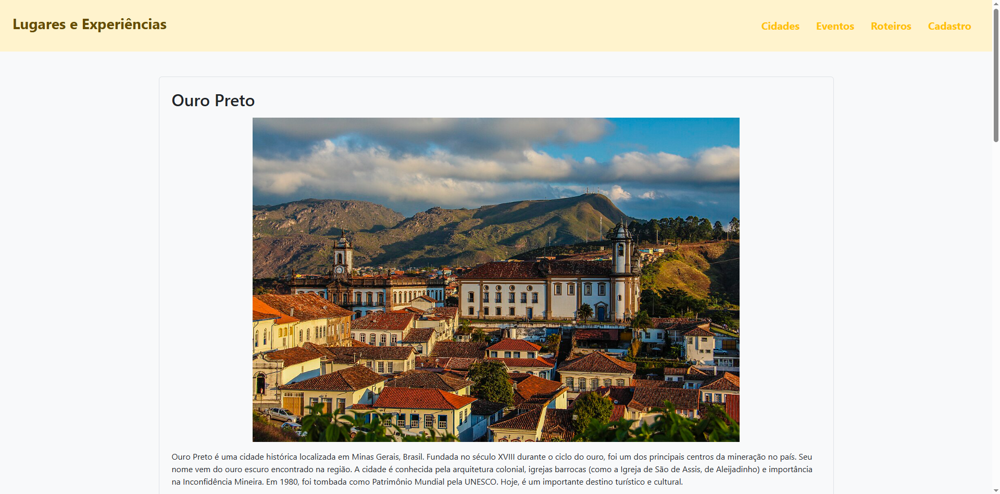
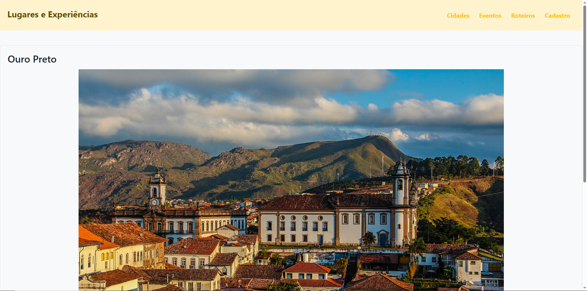
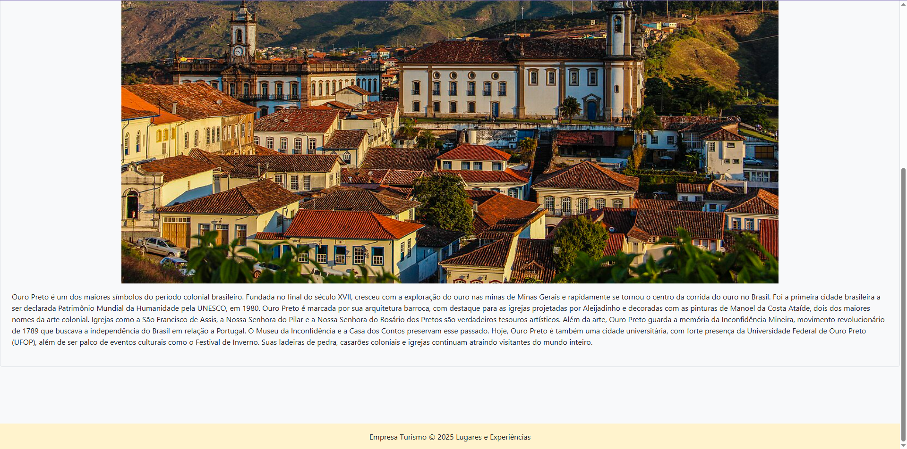

[](https://classroom.github.com/online_ide?assignment_repo_id=20888553&assignment_repo_type=AssignmentRepo)
# Trabalho Prático 05 - Semanas 7 e 8

**Páginas de detalhes dinâmicas**

Nessa etapa, vamos evoluir o trabalho anterior, acrescentando a página de detalhes, conforme o  projeto escolhido. Imagine que a página principal (home-page) mostre um visão dos vários itens que existem no seu site. Ao clicar em um item, você é direcionado pra a página de detalhes. A página de detalhe vai mostrar todas as informações sobre o item do seu projeto. seja esse item uma notícia, filme, receita, lugar turístico ou evento.

Leia o enunciado completo no Canvas. 

**IMPORTANTE:** Assim como informado anteriormente, capriche na etapa pois você vai precisar dessa parte para as próximas semanas. 

**IMPORTANTE:** Você deve trabalhar e alterar apenas arquivos dentro da pasta **`public`,** mantendo os arquivos **`index.html`**, **`styles.css`** e **`app.js`** com estes nomes, conforme enunciado. Deixe todos os demais arquivos e pastas desse repositório inalterados. **PRESTE MUITA ATENÇÃO NISSO.**

## Informações Gerais

- Nome: Ana Clara Castro Carneiro
- Matricula: 898743
- Proposta de projeto escolhida: Lugares e Experiências
- Breve descrição sobre seu projeto: Site que apresenta algumas das cidades históricas de Minas Gerais que já visitei.

## Print da Home-Page



## Print da página de detalhes do item




## Cole aqui abaixo a estrutura JSON utilizada no app.js

```javascript
const cidades = [
    {
        "id": 1,
        "nome": "Ouro Preto",
        "foto": "./ouro_preto.JPG",
        "resumo": "Ouro Preto é uma cidade histórica localizada em Minas Gerais, Brasil. Fundada no século XVIII durante o ciclo do ouro, foi um dos principais centros da mineração no país. Seu nome vem do ouro escuro encontrado na região. A cidade é conhecida pela arquitetura colonial, igrejas barrocas (como a Igreja de São de Assis, de Aleijadinho) e importância na Inconfidência Mineira. Em 1980, foi tombada como Patrimônio Mundial pela UNESCO. Hoje, é um importante destino turístico e cultural.",
        "sobre": "Ouro Preto é um dos maiores símbolos do período colonial brasileiro. Fundada no final do século XVII, cresceu com a exploração do ouro nas minas de Minas Gerais e rapidamente se tornou o centro da corrida do ouro no Brasil. Foi a primeira cidade brasileira a ser declarada Patrimônio Mundial da Humanidade pela UNESCO, em 1980. Ouro Preto é marcada por sua arquitetura barroca, com destaque para as igrejas projetadas por Aleijadinho e decoradas com as pinturas de Manoel da Costa Ataíde, dois dos maiores nomes da arte colonial. Igrejas como a São Francisco de Assis, a Nossa Senhora do Pilar e a Nossa Senhora do Rosário dos Pretos são verdadeiros tesouros artísticos. Além da arte, Ouro Preto guarda a memória da Inconfidência Mineira, movimento revolucionário de 1789 que buscava a independência do Brasil em relação a Portugal. O Museu da Inconfidência e a Casa dos Contos preservam esse passado. Hoje, Ouro Preto é também uma cidade universitária, com forte presença da Universidade Federal de Ouro Preto (UFOP), além de ser palco de eventos culturais como o Festival de Inverno. Suas ladeiras de pedra, casarões coloniais e igrejas continuam atraindo visitantes do mundo inteiro."
    },
    {
        "id": 2,
        "nome": "Sabará",
        "foto": "./sabará.webp",
        "resumo": "Sabará é uma cidade histórica de Minas Gerais, Brasil, que teve grande importância durante o ciclo do ouro no século XVIII. Com ruas de pedra, casarões antigos e igrejas barrocas, preserva viva a memória do período colonial. Um dos principais pontos turísticos da cidade é a Igreja de Nossa Senhora do Ó, construída no século XVIII. Apesar da fachada simples, seu interior é ricamente decorado em estilo barroco e rococó, com entalhes em madeira e pinturas impressionantes. Localizada em um ponto alto, oferece também uma bela vista da região. Sabará é ainda conhecida por eventos culturais, como o tradicional Festival da Jabuticaba.",
        "sobre": "Sabará é uma das cidades históricas mais antigas de Minas Gerais, fundada oficialmente em 1711. Foi também importante centro de mineração de ouro durante o ciclo do ouro. Localiza-se próxima a Belo Horizonte e é conhecida tanto pela sua herança colonial quanto por suas tradições culturais. A cidade se destaca pelas igrejas históricas, como a Igreja de Nossa Senhora do Ó, famosa pelo altar em estilo rococó, e a Igreja Nossa Senhora do Carmo, com obras atribuídas a Aleijadinho. Sabará também preserva o Teatro Municipal, inaugurado em 1819, um dos mais antigos do Brasil ainda em funcionamento. No campo da cultura popular, Sabará é referência em festivais e culinária. O Festival da Jabuticaba é um dos eventos mais conhecidos celebrando a fruta típica da região em pratos, doces e bebidas. A cidade também mantém festas religiosas tradicionais, como a Semana Santa e o Jubileu de Nossa Senhora do Ó. Com suas ruas estreitas de pedra, casarões antigos e tradições vivas, Sabará é um retrato fiel da fusão entre o legado do período colonial e a preservação cultural mineira."
    },
    {
        "id": 3,
        "nome": "Serro",
        "foto": "./serro.avif",
        "resumo": "Serro é uma cidade histórica de Minas Gerais, fundada no século XVIII durante o ciclo do ouro e dos diamantes. Reconhecida por sua arquitetura colonial bem preservada, ruas de pedra e igrejas barrocas, a cidade guarda forte ligação com a cultura mineira. O Serro também é famoso pelo seu tradicional Queijo do Serro, considerado um dos mais antigos do Brasil e patrimônio cultural imaterial. Além da história e da gastronomia, o município se destaca pelas festas religiosas, paisagens naturais e pelo clima acolhedor, atraindo visitantes que buscam turismo cultural e ecológico.",
        "sobre": "Serro é uma das cidades mais tradicionais e charmosas de Minas Gerais, fundada no início do século XVIII. Localizada na Serra do Espinhaço, foi também um importante centro durante o ciclo do ouro, mas com o tempo se destacou pela produção agropecuária e, especialmente, pelo famoso queijo do Serro, reconhecido como patrimônio imaterial do Brasil e símbolo da cultura mineira. A cidade possui um conjunto arquitetônico preservado, com igrejas coloniais e casarões históricos que remetem ao período colonial. A Igreja de Santa Rita, a Igreja de Nossa Senhora da Conceição e a Igreja do Rosário são exemplos da riqueza barroca presente no Serro. Além da história e da gastronomia, o Serro é conhecido por suas festas religiosas e populares, como a Semana Santa e a Festa do Divino Espírito Santo, que atraem turistas e mantêm viva a tradição cultural local. Rodeada por paisagens montanhosas e próxima a destinos como o Parque Nacional da Serra do Cipó, o Serro combina natureza, história e cultura, sendo um destino marcante dentro do roteiro das cidades históricas mineiras."
    }
]
```